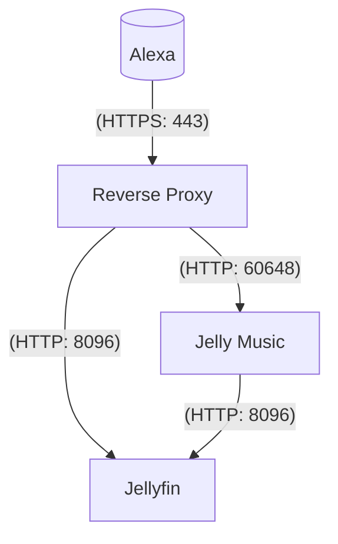

# Jelly Music

[](https://discord.gg/CacbSg2Mza)

## What is Jelly Music?

  

Jelly Music is a **self-hosted Alexa Skill** designed for your Jellyfin server. It allows for you to stream and play music on your Alexa devices using voice commands like:

  

* "Alexa, ask Jelly Music to play album **Creeping Death** by Metallica."

  

* "Alexa, ask Jelly Music to shuffle songs by **Black Sabbath**."

  

---

# IMPORTANT CHANGE:
  For additional security, your container now requires a new environment value **SKILL_ID**  (see: Installation Instructions for more information). 
  
  **If you do not set this your skill will no longer function after updating.**

  Jellyfin music now requires the **"Alexa Presentation Language" Interface**  (see: Installation Instructions for more information).

  **If you do not enable this your skill will no longer function after updating on echo devices.**

## Features

  

* Per device music queues.

  

* Play music from your Jellyfin server.

  

* Support to search by, **Song Name**, **Album Name**, **Artist Name**, **Playlist** and **Genre***.

  

---

  

## Requirements

  

To run a Jelly Music instance, you will need:

  

* A basic understanding of setting up **Docker containers**.

  

* The ability to log into the **Alexa Developer Dashboard** (creating an account is straightforward).

  

* A self-hosted Jellyfin server accessible via a **public address** and secured with a **trusted SSL certificate**.

  

* A Docker container capable of running the Jelly Music server, also accessible via a **public address** and secured with a **trusted SSL certificate**.

  

*  **Recommendation:** Set up an **NGINX reverse proxy server** and **Dynamic DNS (DDNS)** to achieve the public accessibility and trusted certificates.

  
---

## Alpha Software Disclaimer

  

Please note that **Jelly Music** is a side project I'm developing in my spare time.

  

* There's **no guarantee** of ongoing maintenance or updates.

  

* Not all features will be thoroughly tested upon release, so exercise **caution when updating**.

  

* This software comes with **no guarantees of functionality**. I am not an experienced programmer; I'm simply an enthusiast with a hobby.

  

---

## Installation Instructions

  

1. Set up the Docker container using the latest [**Docker image**](https://ghcr.io/rusketh/jellymusic/jellymusic).

    *For stability use the main branch ``ghcr.io/rusketh/jellymusic/jellymusic:main``*
  

2. Ensure you **enable the necessary port** in your Docker configuration.

  

3. Configure the **environment variables** as described below.

  

4. Map or bind a **Data Directory**  ``/data``

  

Here's an example of a `docker run` command:

  

``docker run -e JELLYFIN_HOST="https://Jellyfin.example.com" -e JELLYFIN_KEY="replace_with_your_api_key" -e SKILL_NAME="jelly music" -e PORT="60648" -e SKILL_ID="amzn1.ask.skill.00000000-0000-0000-0000-000000000000" -p 60648:60648 -v "data:/data" ghcr.io/rusketh/jellymusic/jellymusic:main``

  

### Environment Variables

  

The following environment variables are **required**:

  

*  **`JELLYFIN_HOST`**: The public address of your Jellyfin server.


*  **`JELLYFIN_LOCAL`**: **Optional** The full local address and port of your Jellyfin server, used when making API calls.
  

*  **`JELLYFIN_KEY`**: The API key for your Jellyfin server.

  

*  **`SKILL_NAME`**: The two-word name Alexa will use to refer to your Jellyfin server (e.g., "Jelly Music").

  

*  **`SKILL_ID`**: The full application id of your alexa skill (e.g amzn1.ask.skill.00000000-0000-0000-0000-000000000000)

  

*  **`PORT`**: The Port your server will use (remember to enable this port on Docker). *Defaults to 60648*.

  
*  **`LANGUAGE`**: Sets the language Alexa will respond in; *Defaults to EN*.

* **`JELLYFIN_LIMIT`**: The maximum items requested from the Jellyfin API per request. *Defaults to 50*.


**Note:** Your public address for the server needs to run on port `443`, and your reverse proxy should handle the redirect to the specified `PORT`.

*Alexa will only communicate with HTTPS endpoints on port 443.*

### Data Directory

The **configuration file** for Jelly Music, as well as the cached song queue for each connected device, are saved within the `/data` directory.


  

**Important Considerations:**

  

- This directory **must be mapped as a volume** in your Docker container to ensure data persistence. Without it, your configuration will be lost when the container stops or is removed.

  

---

  

## Alexa Skill Setup

  

1. Create an account on the **Alexa Developer Console** using your Amazon account: [https://developer.amazon.com](https://developer.amazon.com)

  

2. Create a **new skill** named `Jelly Music`.

  

3. For "Type of experience," select **"Music & Audio"**.

  

4. For the "Model," choose **"Custom"**.

  

5. For "Hosting Service," choose **"Provision your own"**.

  

**Note:** This container will **not** work with Alexa-Hosted skills.

  

Once your Alexa Skill is created, you need to configure it. This might seem daunting, but it's quite simple as most of the work has been done for you.

  

1. Navigate to **"Endpoint"** and select **"HTTPS"**. Set "Default Region" to the **public address of your Jelly Music server**.

  

2. Navigate to **"Interfaces"** and **enable "Audio Player"** and **enable "Alexa Presentation Language"**. This is crucial for audio streaming & diplaying information on echo devices. The skill will not function without these interfaces enabled.

3. Grab the a preconfigured Alexa Skill JSON file in your language from here: [https://github.com/Rusketh/JellyMusic/blob/main/skill-json](https://github.com/Rusketh/JellyMusic/blob/main/skill-json)


4. Change `interactionModel.languageModel.invocationName` (line 4 in the JSON file) to the name you used for the **`SKILL_NAME` environment variable**, then save the file.

  

5. Navigate to **"Interaction Model"** and open the **"JSON Editor"**. Drag your saved JSON file into the editor (or copy and paste its contents).

  

6. Set the **SKILL_ID** environment value of your docker container to match your skills full id.
*You can find this on the developer portal. Click the Back button to go to your list of skills, then click Copy Skill ID.*


That's it! Click **"Save"** at the top, then hit **"Build Skill"**. Hopefully, after a few minutes, it will build successfully, and you'll be ready to go and install the skill. Start the container and enjoy listening to your music!

  

**Note:** When upgrading to new versions **New Features** will require you to update your ``skill.json`` as described in steps 3 - 4.

  

### Enabling Your Skill in the Alexa App

  

Once your Docker container is running and your Alexa Skill is successfully built in the Alexa Developer Console, you need to enable it within your Alexa app on your mobile device.

  

1. Open the **Alexa app** on your smartphone or tablet.

  

2. Navigate to the **"More"** menu (usually represented by three lines or dots).

  

3. Tap on **"Skills & Games"**.

  

4.  **Scroll to the bottom** of the "Skills & Games" screen and tap on **"Your Skills"**.

  

5. You should see a small dropdown menu, typically labeled "Enabled". Tap on this dropdown and select **"Dev"** (for Development skills).

  

6. Locate and tap on your **"Jelly Music"** skill from the list.

  

7. Tap the **"Enable"** or **"Enable to Use"** button.

  

Your Jelly Music skill should now be active and ready for use on your Alexa devices!

---

## Languages

This skill supports multiple languages using the **LANGUAGE** environment value.

Currently supported languages are:

- **EN** - English
- **NL** - Dutch

---

## Commands

You can use the following commands with Alexa:

"Alexa, ask Jelly Music to..."

*  **Play/Shuffle/Queue** the album `{album name}` [by `{artist name}`]

*  **Play/Shuffle/Queue** songs [by `{artist name}`]

*  **Play/Queue**  `{song name}` [by `{artist name}`]

*  **Play/Queue/Shuffle** playlist `{playlist name}`

*  **Play/Queue/Shuffle**  `{genre}` music

*  **Clear the queue**

As well as using simple commands like stop, play, pause, resume and next.

---


## Network Architecture

Both the Jellyfin server and the Jelly Music container must be available via HTTPS (port 443). This is achieved by using a reverse proxy server such as NGINX with a valid SSL certificate (e.g Lets Encrypt).


Alexa will send commands via the reverse proxy to the Jelly Music container.

Alexa will stream audio files from the Jellyfin server via the reverse proxy.

Jelly Music needs access to the Jellyfin server and it is not recomended for Jelly Music to call the Jellyfin API requests though the internet via the reverse proxy. For this reason it is best practice to set the local address of the jellyfin server so that API requests are transmitted over the local network, this improves both latency and security.

---

### Intents

  

Here is a list of all the current none-standard intents used, the example commands and what they do.

| Intent | Command | Description |
|--|--|--|
| PlaySongIntent | Play song {song} by {artist} | Plays {song} ``(clears queue)``. |
| PlayAlbumIntent | Play the album {album} by {artist} | Plays {album} ``(clears queue)``. |
| PlayArtistIntent | Play songs by {artist} | Plays songs by {artist} ``(clears queue)``. |
| PlayPlaylistIntent | Play playlist {playlist} | Plays songs from {playlist} ``(clears queue)``. |
| PlayGenreIntent | Play {genre} music | Plays music of {genre} ``(clears queue)``. |
| ShuffleAlbumIntent | Shuffle the album {album} by {artist} | Plays & shuffles {album}``(clears queue)``. |
| ShuffleArtistIntent | Shuffle songs by {artist} | Plays & shuffles songs by {artist} ``(clears queue)``.
| ShufflePlaylistIntent | Shuffle playlist {playlist} | Plays & shuffles songs from {playlist} ``(clears queue)``. |
| ShuffleGenreIntent | Shuffle {genre} music | Plays & shuffles music of {genre} ``(clears queue)``. |
| QueueSongIntent | Add {song} to the queue | Adds {song} to queue |
| QueueAlbumIntent | Add the album {album} by {artist} to the queue | Adds {album} to the queue. |
| QueueArtistIntent | Add songs by {artistname} to the queue | Adds songs by {artistname} to the queue. |
| QueuePlaylistIntent | Add playlist {playlist} to the queue | Adds songs from {playlist} to the queue. |
| QueueGenreIntent | Queue {genre} music | Adds {genre} music to the queue. |
---


## Help Developing

As mentioned, this is a work in progress, and I'm not the most skilled programmer. I would be very grateful to anyone who contributes a **Pull Request (PR)** to this project. All I ask is that you try to adhere to my coding style and **test your work** before committing.

***NO AI GENERATED CODE*** 

AI can be used to advise, review and debug but please do not make pull requests using AI generated code (no vibe coding).

## Dockerless

This project is designed for easy development outside of a docker container, by running it directly in `node.js`.

- Git Pull the repository.
- Create the data folder `src/data`.
- Create a config file `src/data/config.json`.
- Run `npm install` from inside the `src` folder.
- Run `node init` from inside the `src` folder.

Example config.json:
```
{
  "Jellyfin": {
    "host": "<JELLYFIN_HOST>",
    "key": "<JELLYFIN_KEY>",
    "local": "<JELLYFIN_LOCAL*>"
    "limit": <JELLYFIN_LIMIT*>,
  },
  "skill": {
    "id": "<SKILL_ID>",
    "name": "<SKILL_NAME>"
  },
  "server": {
    "port": <PORT>
  },
  "log_level": 3,
  "language": "<LANGUAGE*>"
}
```
